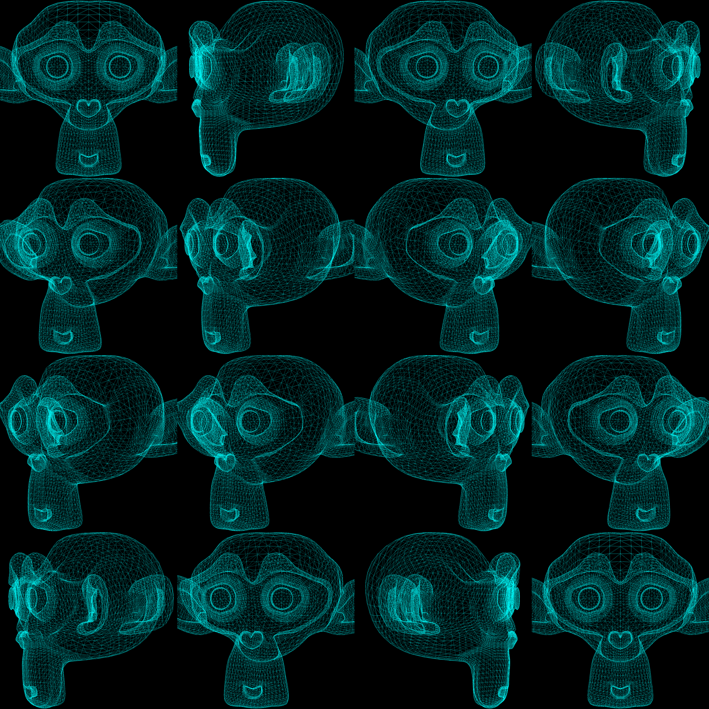
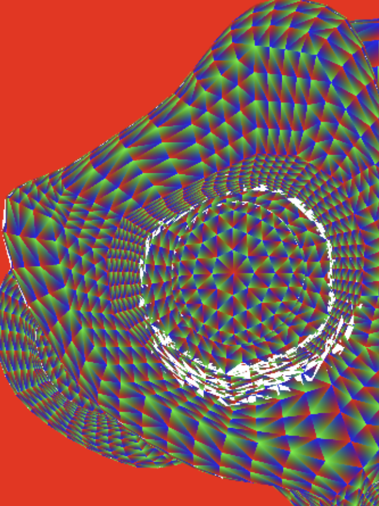
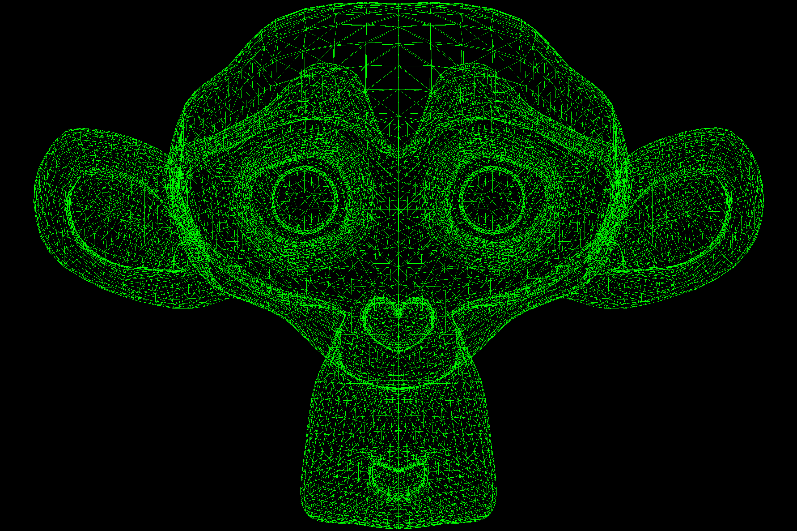
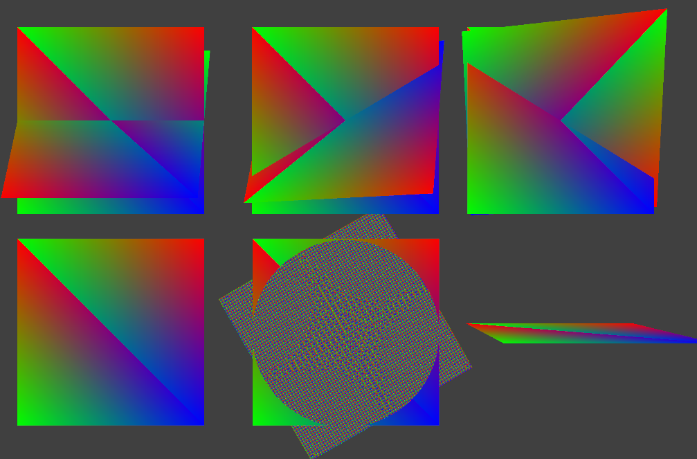

# SwRenderer
 Software renderer for hobbyist, with minimal features.

It is under construction for now, I'm revisiting it after 7 years.

Current build only supports simple line drawing without triangle filling.

> Inspired by tinyrenderer by Dmitry V. Sokolov(ssloy)
> 
> https://github.com/ssloy/tinyrenderer

## Features
 - No graphics API.
 - Vulkan-like interface.
 - CPU rasterization.
 - OBJ loading.
 - TGA output writing.

## Current state

Currently, experiencing precision issue from vertex interpolation.
Image above shows vertex interpolation. "White" pixels are failed depth test with epsilon less than 0.0001.
It has much less precision than expected, I'm suspecting it is due to the multiple stacking floating point arithmetic 
without any hardware acceleration.

### How to build

### Know issues
 - x64 only.
### Measurement

 Before/After noted below means before any optimization/algorithm implementation and after.
 Any implementation applied on "after" build will be noted next to the scene description.
 Without mentioning, these performance metrics are captured in Windows, g++.

  - Scene #1 rendered in 3000*2500, 3 channels.
  - Scene #2 rendered in 8192*8192, 3 channels.
    - Demonstrate multiple viewport render to the same target.
    - Attached scene is scale downed to 2048*2048.
  - Scene #3 rendered in 4096*4096, 3 channels.
    - Demonstrate depth precision. If precision is high enough, there should be a circle fits almost perfectly to the center square.

| Render |  |           |  |
|--------|---------------------------------------------------|---------------------------------------------------|----------------------------------------------|
| Before | 6.163932s                                         | 0.7941572s                                        | 0.4022528s                                   |
| After  | 0.05273832s(More than 100x faster)                | 0.7359066s(7%, without SIMD. 0.7408656s for SIMD) | 0.3891932s (SIMD)                            |
### Credits
 The function "plotLine" adapted from :
 > "A Rasterizing Algorithm for Drawing Curves"
 > by Alois Zingl
 > 
 Licensed under the MIT License.
